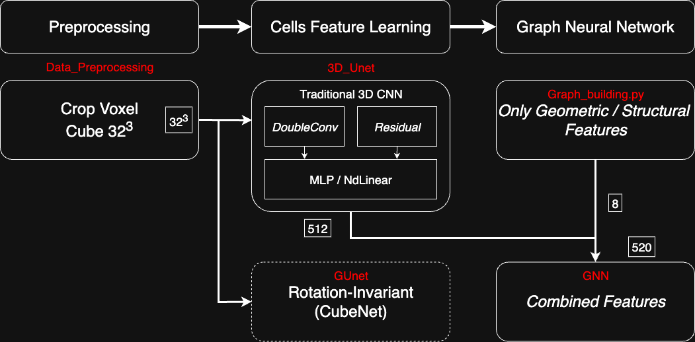

# Feature Learning in 3D Voxel Data

## 📘 Project Overview

This repository contains the implementation of my Master's thesis. The following sections describe the structure of the code and the rationale behind the design.



### 🧱 Step 1: Data Preprocessing

As shown in the figure, the first step involves preprocessing the data and slicing it into the desired 3D image sizes. This step is implemented in the folder:

`
Data_Preprocessing/
`

### 🔍 Step 2: Cell Feature Extraction

The second step focuses on extracting cell features. We begin with **self-supervised pretraining using an autoencoder**. Two different modules within `3D_Unet/` are used in this stage:

* `DoubleConv`
* `ResBlockPNI (Residual)`

Afterward, the extracted features are passed through an `MLP` or `NdLinear` layer. The loss is calculated based on image pair matching. The encoder compresses the features into **512-dimensional vectors**.

The relevant folders are:

* `3D_Unet/`

* `GUnet/`

### 🔗 Step 3: Graph Matching with GNN

In the third step, we use `Graph_building.py` to construct the graph (it's in `GNN/`). Then, we apply the **GAT (Graph Attention Network)** architecture from Graph Neural Networks to perform graph matching.

---

### 📄 More Details

For more details, please refer to the full thesis document available at:

`Thesis/Master Thesis.pdf`

---

# References

Part of this repository was taken from the [Cubenet repository](https://github.com/danielewworrall/cubenet), which implements some model examples described in this [ECCV18 article](https://arxiv.org/abs/1804.04458):

```
@inproceedings{Worrall18,
  title     = {CubeNet: Equivariance to 3D Rotation and Translation},
  author    = {Daniel E. Worrall and Gabriel J. Brostow},
  booktitle = {Computer Vision - {ECCV} 2018 - 15th European Conference, Munich,
               Germany, September 8-14, 2018, Proceedings, Part {V}},
  pages     = {585--602},
  year      = {2018},
  doi       = {10.1007/978-3-030-01228-1\_35},
}
```

The code in `./GUnet/src_GUNet/utils/normalization/SwitchNorm3d` was taken from the [SwitchNorm repository](https://github.com/switchablenorms/Switchable-Normalization/blob/master/devkit/ops/switchable_norm.py), which corresponds to:

```
@article{SwitchableNorm,
  title={Differentiable Learning-to-Normalize via Switchable Normalization},
  author={Ping Luo and Jiamin Ren and Zhanglin Peng and Ruimao Zhang and Jingyu Li},
  journal={International Conference on Learning Representation (ICLR)},
  year={2019}
}
```

Some of the code in `./GUnet/src_GUNet/architectures` was inspired from this [3D U-Net repository](https://github.com/JielongZ/3D-UNet-PyTorch-Implementation), as well as from the structure described in [Dilated Dense U-Net for Infant Hippocampus Subfield Segmentation](https://www.frontiersin.org/articles/10.3389/fninf.2019.00030/full):

```
@article{zhu_dilated_2019,
	title = {Dilated Dense U-Net for Infant Hippocampus Subfield Segmentation},
	url = {https://www.frontiersin.org/article/10.3389/fninf.2019.00030/full},
	doi = {10.3389/fninf.2019.00030},
	journaltitle = {Front. Neuroinform.},
	author = {Zhu, Hancan and Shi, Feng and Wang, Li and Hung, Sheng-Che and Chen, Meng-Hsiang and Wang, Shuai and Lin, Weili and Shen, Dinggang},
	year = {2019},
}
```

Some of the code for the losses in `./GUnet/src_GUNet/training` was taken from this [Repository: Differentiation of Blackbox Combinatorial Solvers](https://github.com/martius-lab/blackbox-differentiation-combinatorial-solvers), which corresponds to:

```
@inproceedings{VlastelicaEtal2020:BBoxSolvers,
  title = {Differentiation of Blackbox Combinatorial Solvers},
  booktitle = {International Conference on Learning Representations},
  series = {ICLR'20},
  month = may,
  year = {2020},
  note = {*Equal Contribution},
  slug = {vlastelicaetal2020-bboxsolvers},
  author = {Vlastelica*, Marin and Paulus*, Anselm and Musil, V{\'i}t and Martius, Georg and Rol{\'i}nek, Michal},
  url = {https://openreview.net/forum?id=BkevoJSYPB},
  month_numeric = {5}
}
```

# License

This repository is covered by the MIT license, but some exceptions apply, and are listed below:
- The file in `./GUnet/src_GUNet/utils/normalization/SwitchNorm3d` was taken from the [SwitchNorm repository](https://github.com/switchablenorms/Switchable-Normalization/blob/master/devkit/ops/switchable_norm.py) by Ping Luo and Jiamin Ren and Zhanglin Peng and Ruimao Zhang and Jingyu Li, and is covered by the [CC-BY-NC 4.0 LICENSE](https://creativecommons.org/licenses/by-nc/4.0/), as mentionned also at the top of the file.